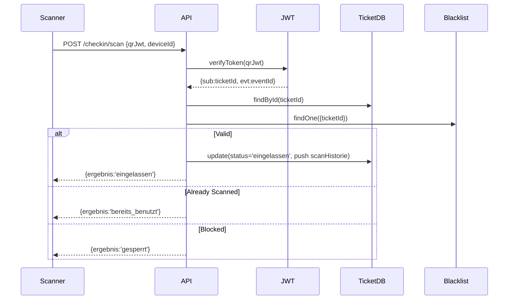

# Ticketing-System – Check-in & Validation

**Projekt:** EventApp  
**Stand:** Januar 2025

---

## 1. Scan-Flow



---

## 2. Endpoints

### 2.1 POST /checkin/scan

**Datei:** `src/controllers/checkinController.ts:12-108`

**Request:**
```json
{
  "qrJwt": "eyJhbGc...",
  "deviceId": "scanner-001",
  "modus": "tuer"
}
```

**Validation Steps:**
1. JWT-Signature prüfen
2. Ticket existiert?
3. Blacklist-Check
4. Status-Check (erstattet/gesperrt)
5. Bereits eingecheckt?
6. Update Status + Scan-Historie

**Response Codes:**
- `eingelassen`: Check-in erfolgreich
- `bereits_benutzt`: Schon gescannt
- `ungueltig`: JWT invalid oder Ticket nicht gefunden
- `gesperrt`: Auf Blacklist
- `erstattet`: Order refunded
- `fehler`: Technischer Fehler

---

## 3. Security

### 3.1 Rate Limiting (Empfohlen)

```typescript
// Per deviceId
max 60 scans/minute

// Per ticketId
max 5 attempts/minute (für Failed Scans)
```

---

## 4. Offline-Fähigkeit

### 4.1 JWT-Verify Offline

```typescript
verifyTokenOffline(token: string): boolean {
  try {
    this.verifyToken(token);
    return true;
  } catch (error) {
    return false;
  }
}
```

**Funktioniert:** Signature-Prüfung ohne Backend  
**Funktioniert NICHT:** Status-Update, Blacklist-Check

---

**Ende Check-in & Validation**
