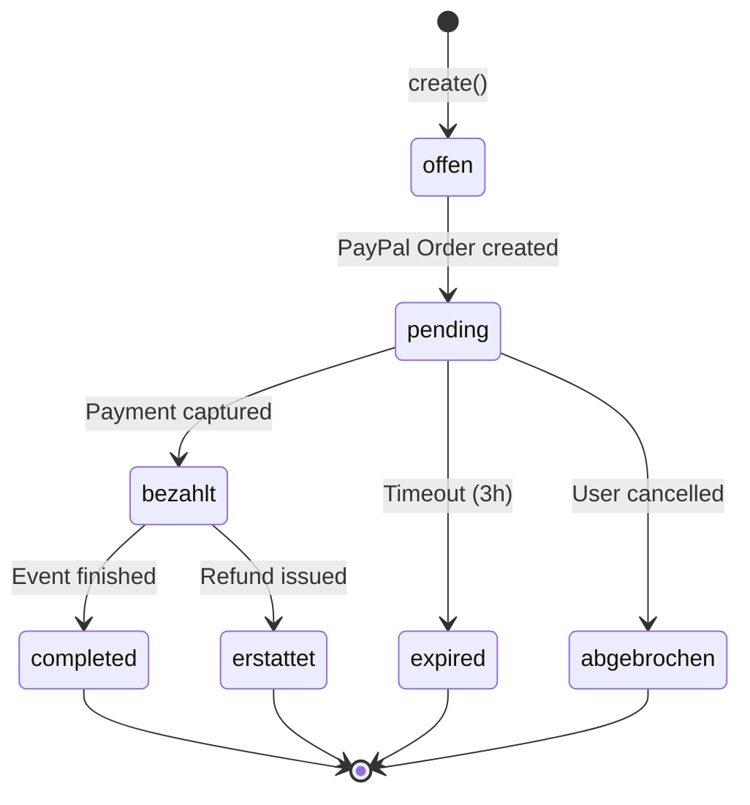
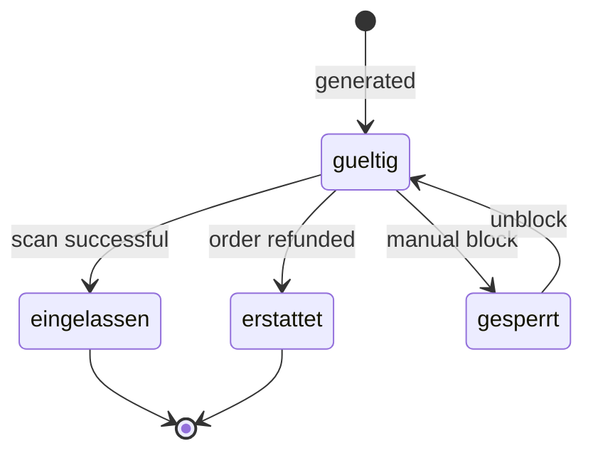
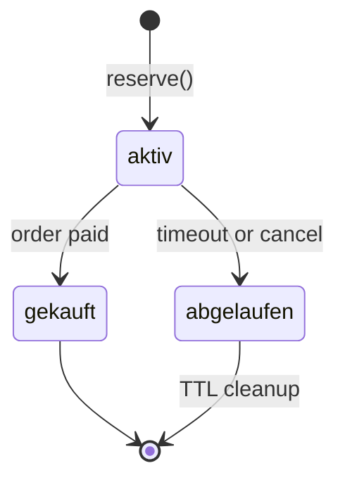

# Ticketing-System – Datenmodelle

**Projekt:** EventApp  
**Stand:** Januar 2025

---

## 1. Order (Bestellung)

**Collection:** `bestellungen`  
**Datei:** `src/models/Order.ts`

### 1.1 Schema

| Feld | Typ | Required | Index | Default | Beschreibung |
|------|-----|----------|-------|---------|--------------|
| `_id` | ObjectId | ✅ | Primary | auto | MongoDB ID |
| `buyerUserId` | String | ❌ | ✅ | - | Firebase UID (optional für Gäste) |
| `email` | String | ✅ | ✅ | - | Käufer-Email (lowercase) |
| `vorname` | String | ❌ | - | - | Vorname |
| `nachname` | String | ❌ | - | - | Nachname |
| `telefon` | String | ❌ | - | - | Telefonnummer |
| `eventId` | ObjectId | ✅ | ✅ | - | Ref: Event |
| `positionen` | Array | ✅ | - | - | Bestellpositionen (siehe unten) |
| `summeBrutto` | Number | ✅ | - | - | Gesamtsumme inkl. MwSt. |
| `summeNetto` | Number | ❌ | - | - | Nettosumme |
| `mwstBetrag` | Number | ❌ | - | - | MwSt.-Betrag |
| `plattformFee` | Number | ✅ | - | - | Platform-Gebühr (5%) |
| `waehrung` | String | ✅ | - | 'EUR' | Währungscode (uppercase) |
| `status` | String | ✅ | ✅ | 'offen' | Order-Status (siehe Statusmaschine) |
| `paypalOrderId` | String | ❌ | Unique (sparse) | - | PayPal Order ID |
| `paypalCaptureId` | String | ❌ | Unique (sparse) | - | PayPal Capture ID (Idempotenz!) |
| `idempotenzKey` | String | ❌ | Unique (sparse) | - | Custom Idempotenz-Key |
| `agbAkzeptiert` | Boolean | ✅ | - | false | AGB akzeptiert |
| `dsgvoAkzeptiert` | Boolean | ✅ | - | false | DSGVO akzeptiert |
| `widerrufsbelehrungGelesen` | Boolean | ✅ | - | false | Widerrufsbelehrung gelesen |
| `erstellt_at` | Date | ✅ | - | now | Erstellungszeitpunkt |
| `bezahlt_at` | Date | ❌ | - | - | Bezahlzeitpunkt |
| `refundedAt` | Date | ❌ | - | - | Rückerstattungszeitpunkt |
| `refundReason` | String | ❌ | - | - | Rückerstattungsgrund |
| `payoutStatus` | String | ❌ | - | - | 'pending' \| 'paid' \| 'failed' |
| `payoutDate` | Date | ❌ | - | - | Auszahlungsdatum |
| `payoutBatchId` | String | ❌ | - | - | PayPal Payout Batch ID |
| `payoutAmount` | Number | ❌ | - | - | Ausgezahlter Betrag |
| `platformFee` | Number | ❌ | - | - | Einbehaltene Platform-Gebühr |

### 1.2 Subdocument: Positionen

```typescript
interface IOrderPosition {
  ticketVarianteId: ObjectId;    // Ref: TicketVariant
  menge: number;                 // Min: 1
  einzelpreisBrutto: number;     // Min: 0
}
```

### 1.3 Indizes

```typescript
// Compound indexes
{ eventId: 1, status: 1, erstellt_at: -1 }
{ email: 1, eventId: 1 }
{ paypalCaptureId: 1 } // unique, sparse
```

### 1.4 Statusmaschine



**Status-Werte:**
- `offen`: Order erstellt, kein PayPal Order
- `pending`: PayPal Order erstellt, warte auf User-Approval
- `bezahlt`: Payment captured, Tickets generiert
- `confirmed`: Synonym für `bezahlt` (legacy)
- `completed`: Event abgeschlossen
- `erstattet`: Refund durchgeführt
- `refunded`: Synonym für `erstattet`
- `abgebrochen`: User oder System abgebrochen
- `cancelled`: Synonym für `abgebrochen`
- `expired`: PayPal Order abgelaufen

### 1.5 Business Rules

1. **Consent-Prüfung:** `agbAkzeptiert && dsgvoAkzeptiert && widerrufsbelehrungGelesen` müssen `true` sein
2. **Platform Fee Berechnung:** `plattformFee = Math.round(summeBrutto * 0.05 * 100) / 100`
3. **Idempotenz:** `paypalCaptureId` ist unique – Webhook kann mehrfach eintreffen
4. **Ticket-Generation:** Nur bei Status `bezahlt` oder `confirmed`

---

## 2. Ticket

**Collection:** `tickets`  
**Datei:** `src/models/Ticket.ts`

### 2.1 Schema

| Feld | Typ | Required | Index | Default | Beschreibung |
|------|-----|----------|-------|---------|--------------|
| `_id` | ObjectId | ✅ | Primary | auto | MongoDB ID |
| `bestellungId` | ObjectId | ✅ | ✅ | - | Ref: Order |
| `eventId` | ObjectId | ✅ | ✅ | - | Ref: Event |
| `ticketVarianteId` | ObjectId | ✅ | - | - | Ref: TicketVariant |
| `qrToken` | String | ✅ | Unique | - | JWT-signierter Token |
| `status` | String | ✅ | ✅ | 'gueltig' | Ticket-Status |
| `name` | String | ❌ | - | - | Name des Ticket-Inhabers |
| `email` | String | ❌ | - | - | Email (kopiert von Order) |
| `scanHistorie` | Array | ✅ | - | [] | Scan-Historie (siehe unten) |
| `created_at` | Date | ✅ | - | now | Erstellungszeitpunkt |
| `updated_at` | Date | ✅ | - | now | Letztes Update |

### 2.2 Subdocument: ScanHistorie

```typescript
interface IScanHistorie {
  zeitpunkt: Date;              // Scan-Zeitpunkt
  deviceId: string;             // Scanner Device ID
  modus: 'tuer' | 'abendkasse' | 'manuell';
  userId?: string;              // Firebase UID des Scanners
}
```

### 2.3 Indizes

```typescript
{ eventId: 1, status: 1 }
{ qrToken: 1 } // unique
{ bestellungId: 1 }
```

### 2.4 Statusmaschine



**Status-Werte:**
- `neu`: Initial (legacy, nicht mehr verwendet)
- `gueltig`: Valide, bereit für Check-in
- `eingelassen`: Check-in durchgeführt
- `erstattet`: Order refunded
- `gesperrt`: Manuell gesperrt (Blacklist)

### 2.5 QR-Token Format (JWT)

**Algorithmus:** HS256 oder RS256  
**Secret:** `JWT_SECRET` oder RSA-Keypair  
**Expiry:** 365 Tage

**Payload:**
```json
{
  "sub": "64abc123...",           // ticketId
  "evt": "64def456...",           // eventId
  "typ": "64ghi789...",           // ticketVarianteId
  "ver": 1,                       // Schema-Version
  "timestamp": 1704067200000,
  "random": "x3k9m2p",
  "iat": 1704067200,
  "exp": 1735603200
}
```

---

## 3. TicketVariant (Ticket-Typ)

**Collection:** `ticketvarianten`  
**Datei:** `src/models/TicketVariant.ts`

### 3.1 Schema

| Feld | Typ | Required | Index | Default | Beschreibung |
|------|-----|----------|-------|---------|--------------|
| `_id` | ObjectId | ✅ | Primary | auto | MongoDB ID |
| `eventId` | ObjectId | ✅ | ✅ | - | Ref: Event |
| `name` | String | ✅ | - | - | Ticket-Name (z.B. "Early Bird") |
| `beschreibung` | String | ❌ | - | - | Beschreibung |
| `preisBrutto` | Number | ✅ | - | - | Preis inkl. MwSt. (Min: 0) |
| `preisNetto` | Number | ❌ | - | - | Auto-berechnet wenn leer |
| `mwstSatz` | Number | ✅ | - | 19 | MwSt.-Satz in % (0-100) |
| `kontingentGesamt` | Number | ✅ | - | - | Gesamtkontingent (Min: 1) |
| `kontingentVerkauft` | Number | ✅ | - | 0 | Verkaufte Tickets (Min: 0) |
| `proKaeuferLimit` | Number | ❌ | - | - | Max. Tickets pro Käufer |
| `saleStart` | Date | ❌ | - | - | Verkaufsstart (top-level) |
| `saleEnd` | Date | ❌ | - | - | Verkaufsende (top-level) |
| `verkaufsfenster` | Object | ❌ | ✅ | - | Legacy nested (deprecated) |
| `status` | String | ✅ | ✅ | 'live' | 'draft' \| 'live' \| 'sold_out' \| 'hidden' |
| `sichtbar` | Boolean | ✅ | - | true | Legacy (deprecated) |
| `checkNachweis` | Boolean | ✅ | - | false | Nachweis erforderlich (z.B. Student) |
| `nachweisText` | String | ❌ | - | - | Nachweis-Beschreibung |
| `mindestalter` | Number | ❌ | - | - | Mindestalter (Min: 0) |
| `istAbendkasse` | Boolean | ✅ | - | false | Abendkasse-Ticket |
| `sort` | Number | ✅ | - | 0 | Sortierreihenfolge |
| `gebuehrenHinweis` | String | ❌ | - | - | Gebührenhinweis |
| `isNameBound` | Boolean | ✅ | - | false | Personalisiert (Name erforderlich) |
| `created_at` | Date | ✅ | - | now | Erstellungszeitpunkt |
| `updated_at` | Date | ✅ | - | now | Letztes Update |

### 3.2 Subdocument: Verkaufsfenster (Legacy)

```typescript
verkaufsfenster?: {
  start?: Date;
  ende?: Date;
  timezone?: string;  // Default: 'Europe/Berlin'
}
```

### 3.3 Indizes

```typescript
{ eventId: 1, sichtbar: 1, sort: 1 }
{ eventId: 1, 'verkaufsfenster.start': 1, 'verkaufsfenster.ende': 1 }
```

### 3.4 Pre-Save Hooks

```typescript
// 1. Auto-calculate preisNetto
if (!preisNetto) {
  preisNetto = preisBrutto / (1 + mwstSatz / 100);
}

// 2. Auto-set sold_out status
if (kontingentVerkauft >= kontingentGesamt && status === 'live') {
  status = 'sold_out';
}
```

### 3.5 Verfügbarkeit Berechnung

```typescript
verfügbar = kontingentGesamt - kontingentVerkauft - aktivReservierungen
```

**Wo berechnet:** `TicketReservationService.reserveTickets()`  
**Atomic:** Via MongoDB Transaction

---

## 4. TicketReservation (Temporäre Reservierung)

**Collection:** `ticket_reservierungen`  
**Datei:** `src/models/TicketReservation.ts`

### 4.1 Schema

| Feld | Typ | Required | Index | Default | Beschreibung |
|------|-----|----------|-------|---------|--------------|
| `_id` | ObjectId | ✅ | Primary | auto | MongoDB ID |
| `ticketVarianteId` | ObjectId | ✅ | ✅ | - | Ref: TicketVariant |
| `reserviert_fuer` | String | ✅ | ✅ | - | Session ID oder User ID |
| `menge` | Number | ✅ | - | - | Anzahl reservierter Tickets (Min: 1) |
| `expires_at` | Date | ✅ | ✅ (TTL) | - | Ablaufzeitpunkt |
| `status` | String | ✅ | ✅ | 'aktiv' | 'aktiv' \| 'abgelaufen' \| 'gekauft' |
| `bestellungId` | ObjectId | ❌ | - | - | Ref: Order (nach Kauf) |
| `created_at` | Date | ✅ | - | now | Erstellungszeitpunkt |
| `updated_at` | Date | ✅ | - | now | Letztes Update |

### 4.2 Indizes

```typescript
{ ticketVarianteId: 1, status: 1 }
{ expires_at: 1, status: 1 }
{ reserviert_fuer: 1, status: 1 }
{ expires_at: 1 } // TTL-Index: expireAfterSeconds: 3600 (1h)
```

### 4.3 Lifecycle

**Default Timeout:** 10 Minuten (konfigurierbar)  
**TTL-Cleanup:** MongoDB löscht automatisch nach 1 Stunde nach `expires_at`



### 4.4 Atomic Reserve-Logic

```typescript
// src/services/TicketReservationService.ts:18-94
const session = await mongoose.startSession();
session.startTransaction();
try {
  // 1. Lock variante
  const variante = await TicketVariant.findById(id).session(session);
  
  // 2. Clean expired
  await cleanupExpiredReservations(id, session);
  
  // 3. Aggregate active reservations
  const activeReservations = await TicketReservation.aggregate([
    { $match: { ticketVarianteId, status: 'aktiv', expires_at: { $gte: now } } },
    { $group: { _id: null, total_reserved: { $sum: '$menge' } } }
  ]).session(session);
  
  // 4. Check availability
  const available = variante.kontingentGesamt - variante.kontingentVerkauft - totalReserved;
  if (available < menge) abort();
  
  // 5. Create reservation
  await TicketReservation.create([{...}], { session });
  
  await session.commitTransaction();
} catch {
  await session.abortTransaction();
}
```

---

## 5. CheckinSperrliste (Blacklist)

**Collection:** `checkin_sperrliste`  
**Datei:** `src/models/CheckinSperrliste.ts`

### 5.1 Schema

| Feld | Typ | Required | Index | Default | Beschreibung |
|------|-----|----------|-------|---------|--------------|
| `_id` | ObjectId | ✅ | Primary | auto | MongoDB ID |
| `ticketId` | ObjectId | ✅ | Unique | - | Ref: Ticket |
| `grund` | String | ✅ | - | - | Sperrgrund |
| `gesetzt_at` | Date | ✅ | - | now | Sperrzeitpunkt |
| `gesetzt_von` | String | ✅ | - | - | Firebase UID des Admins |

### 5.2 Indizes

```typescript
{ ticketId: 1 } // unique
```

### 5.3 Verwendung

- **Block:** Eintrag erstellen + Ticket.status = 'gesperrt'
- **Unblock:** Eintrag löschen + Ticket.status = 'gueltig'
- **Scan:** Prüfung vor Check-in

---

## 6. Event (Kontext)

**Collection:** `events`  
**Datei:** `src/models/Event.ts`

### 6.1 Ticketing-relevante Felder

| Feld | Typ | Beschreibung |
|------|-----|--------------|
| `isFree` | Boolean | Kostenlos (keine Tickets) |
| `paymentProvider` | String | 'paypal' \| 'stripe' \| 'none' |
| `organizerPaypalEmail` | String | PayPal-Email des Organizers |
| `stripeAccountId` | String | Stripe Connect Account ID |
| `priceBucket` | String | 'zeroToFive' \| 'fiveToFifteen' \| 'overFifteen' |
| `estimatedPrice` | Number | Ungefährer Preis (Anzeige) |
| `capacity` | Number | Max. Kapazität |

**Hinweis:** Event.paymentProvider ist definiert, aber im Ticketing-Code wird nur PayPal verwendet.

---

## 7. Organizer (Kontext)

**Collection:** `organizers`  
**Datei:** `src/models/Organizer.ts` (nicht im Scan, aber referenziert)

### 7.1 Ticketing-relevante Felder (Annahme)

```typescript
{
  abrechnungsEinstellungen?: {
    paypalEmail?: string;
    plattformFeeProzent?: number;  // Default: 5
    plattformFeeFix?: number;      // Default: 0
  },
  paypalOAuth?: {
    merchantEmail?: string;
    merchantId?: string;
    connectedAt?: Date;
  }
}
```

**Verwendung in Payout:** `PayPalPayoutService` sucht zuerst `paypalOAuth.merchantEmail`, dann `abrechnungsEinstellungen.paypalEmail`.

---

## 8. Datenfluss-Beispiel: Order → Ticket

### 8.1 Ausgangslage
```json
// Order erstellt
{
  "_id": "64abc123",
  "email": "user@example.com",
  "eventId": "64def456",
  "positionen": [
    { "ticketVarianteId": "64ghi789", "menge": 2, "einzelpreisBrutto": 15.00 }
  ],
  "summeBrutto": 30.00,
  "plattformFee": 1.50,
  "status": "offen"
}
```

### 8.2 Nach Payment Capture
```json
// Order updated
{
  "status": "bezahlt",
  "paypalCaptureId": "5TY123456",
  "bezahlt_at": "2025-01-15T10:30:00Z"
}
```

### 8.3 Tickets generiert (2 Stück)
```json
// Ticket 1
{
  "_id": "64jkl111",
  "bestellungId": "64abc123",
  "eventId": "64def456",
  "ticketVarianteId": "64ghi789",
  "qrToken": "eyJhbGciOiJIUzI1NiIsInR5cCI6IkpXVCJ9.eyJzdWIiOiI2NGprbDExMSIsImV2dCI6IjY0ZGVmNDU2IiwidHlwIjoiNjRnaGk3ODkiLCJ2ZXIiOjEsImlhdCI6MTcwNTMxNzAwMCwiZXhwIjoxNzM2ODUzMDAwfQ.signature",
  "status": "gueltig",
  "email": "user@example.com"
}

// Ticket 2
{
  "_id": "64jkl222",
  // ... analog
}
```

### 8.4 TicketVariant updated
```json
{
  "_id": "64ghi789",
  "kontingentVerkauft": 42,  // war 40, jetzt +2
  "status": "live"           // oder "sold_out" wenn kontingent erreicht
}
```

---

## 9. Typendefinitionen (TypeScript)

### 9.1 Order-Interface

```typescript
// src/models/Order.ts:3-38
export interface IOrderPosition {
  ticketVarianteId: mongoose.Types.ObjectId;
  menge: number;
  einzelpreisBrutto: number;
}

export interface IOrder extends Document {
  buyerUserId?: string;
  email: string;
  vorname?: string;
  nachname?: string;
  telefon?: string;
  eventId: mongoose.Types.ObjectId;
  positionen: IOrderPosition[];
  summeBrutto: number;
  summeNetto?: number;
  mwstBetrag?: number;
  plattformFee: number;
  waehrung: string;
  status: 'offen' | 'bezahlt' | 'erstattet' | 'abgebrochen' | 'pending' | 'confirmed' | 'refunded' | 'cancelled' | 'expired' | 'completed';
  paypalOrderId?: string;
  paypalCaptureId?: string;
  idempotenzKey?: string;
  agbAkzeptiert: boolean;
  dsgvoAkzeptiert: boolean;
  widerrufsbelehrungGelesen: boolean;
  erstellt_at: Date;
  bezahlt_at?: Date;
  refundedAt?: Date;
  refundReason?: string;
  payoutStatus?: 'pending' | 'paid' | 'failed';
  payoutDate?: Date;
  payoutBatchId?: string;
  payoutAmount?: number;
  platformFee?: number;
}
```

### 9.2 Ticket-Interface

```typescript
// src/models/Ticket.ts:3-21
export interface IScanHistorie {
  zeitpunkt: Date;
  deviceId: string;
  modus: 'tuer' | 'abendkasse' | 'manuell';
  userId?: string;
}

export interface ITicket extends Document {
  bestellungId: mongoose.Types.ObjectId;
  eventId: mongoose.Types.ObjectId;
  ticketVarianteId: mongoose.Types.ObjectId;
  qrToken: string;
  status: 'neu' | 'gueltig' | 'eingelassen' | 'erstattet' | 'gesperrt';
  name?: string;
  email?: string;
  scanHistorie: IScanHistorie[];
  created_at: Date;
  updated_at: Date;
}
```

---

## 10. Constraints & Validierung

### 10.1 Database Constraints

- **Unique Indexes:** `paypalCaptureId`, `paypalOrderId`, `idempotenzKey`, `qrToken`, `ticketId` (Sperrliste)
- **Required Fields:** Siehe Tabellen oben
- **Min/Max:** `menge >= 1`, `preisBrutto >= 0`, `mwstSatz 0-100`

### 10.2 Application-Level Validation

```typescript
// orderController.ts:39-43
if (!agbAkzeptiert || !dsgvoAkzeptiert || !widerrufsbelehrungGelesen) {
  return res.status(400).json({
    error: { code: 'MISSING_CONSENT', message: 'Terms must be accepted' }
  });
}
```

```typescript
// TicketReservationService.ts:52-60
if (available < menge) {
  return {
    success: false,
    error: 'Not enough tickets available',
    available: Math.max(0, available)
  };
}
```

---

**Ende der Datenmodelle**  
Nächstes Dokument: `API_CONTRACT_TICKETING.md`
