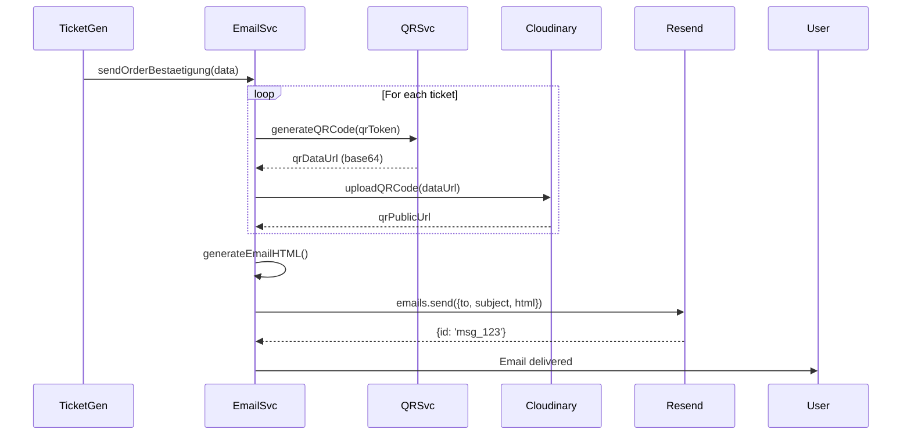

# Ticketing-System – Email & QR Specification

**Projekt:** EventApp  
**Stand:** Januar 2025

---

## 1. QR-Code Specification

### 1.1 Format: JWT

**Algorithm:** HS256 (Fallback) oder RS256 (Production-Empfehlung)  
**Datei:** `src/services/TicketQRService.ts:1-131`

#### Payload Structure

```json
{
  "sub": "64jkl111abc222333444",    // ticketId (Subject)
  "evt": "64def456ghi789012345",    // eventId
  "typ": "64ghi789jkl012345678",    // ticketVarianteId
  "ver": 1,                         // Schema Version (future-proof)
  "iat": 1704067200,                // Issued At (Unix timestamp)
  "exp": 1735603200                 // Expiration (Unix timestamp, 365d default)
}
```

#### Signature

**HS256 (Symmetric):**
```typescript
const token = jwt.sign(payload, JWT_SECRET, { algorithm: 'HS256' });
```

**RS256 (Asymmetric, empfohlen):**
```typescript
const token = jwt.sign(payload, PRIVATE_KEY, { algorithm: 'RS256' });
```

**Secret/Keys:**
- `JWT_SECRET`: Symmetric Key (fallback)
- `JWT_PRIVATE_KEY`: RSA Private Key (PEM format)
- `JWT_PUBLIC_KEY`: RSA Public Key (PEM format)

---

### 1.2 Token Expiry

**Default:** 365 Tage  
**Konfigurierbar:** Via `expiresIn` Parameter

```typescript
generateToken({
  ticketId,
  eventId,
  ticketVarianteId,
  expiresIn: '24h' // Optional: für Door-Time-Window
});
```

---

### 1.3 QR-Code Generation

**Library:** `qrcode` (npm)  
**Datei:** `src/services/TicketQRService.ts:82-115`

#### PNG Data URL

```typescript
const qrDataUrl = await QRCode.toDataURL(token, {
  errorCorrectionLevel: 'H',  // High (30% recovery)
  type: 'image/png',
  width: 400,                 // 400x400 px
  margin: 2                   // Quiet zone
});
// Output: "data:image/png;base64,iVBORw0KGgoAAAANSUhEUgAA..."
```

#### PNG Buffer (Email Attachment)

```typescript
const buffer = await QRCode.toBuffer(token, {
  errorCorrectionLevel: 'H',
  type: 'png',
  width: 400,
  margin: 2
});
// Output: Buffer
```

---

### 1.4 Verification

**Datei:** `src/services/TicketQRService.ts:62-77`

```typescript
verifyToken(token: string): TicketQRPayload {
  const algorithm = PUBLIC_KEY.includes('BEGIN') ? 'RS256' : 'HS256';
  const secret = algorithm === 'RS256' ? PUBLIC_KEY : JWT_SECRET;

  const decoded = jwt.verify(token, secret, {
    algorithms: [algorithm]
  });

  return decoded;
}
```

**Fehler:**
- `TokenExpiredError`: Token abgelaufen
- `JsonWebTokenError`: Ungültige Signature oder Format

---

### 1.5 Offline Verification

```typescript
verifyTokenOffline(token: string): boolean {
  try {
    this.verifyToken(token);
    return true;
  } catch (error) {
    return false;
  }
}
```

**Use Case:** Scanner ohne Internet-Verbindung

---

## 2. Email Service

### 2.1 Provider: Resend

**Datei:** `src/services/TicketEmailService.ts:1-337`  
**Library:** `resend` (npm)

#### Configuration

```typescript
const resend = new Resend(process.env.MAIL_API_KEY);
const fromEmail = process.env.MAIL_FROM || 'noreply@eventapp.de';
```

**ENV Variables:**
- `MAIL_API_KEY`: Resend API Key (starts with `re_...`)
- `MAIL_FROM`: Sender Email (verified in Resend)

---

### 2.2 Email Types

#### Order Confirmation (Primary)

**Trigger:** Nach Payment Capture  
**Template:** Inline HTML (113-169)

```typescript
sendOrderBestaetigung(data: OrderEmailData): Promise<void>
```

**Data:**
```typescript
interface OrderEmailData {
  email: string;
  bestellungId: string;
  eventTitle: string;
  tickets: TicketEmailData[];
  summeBrutto: number;
  waehrung: string;
}

interface TicketEmailData {
  ticketId: string;
  eventTitle: string;
  eventDate: string;
  ticketVarianteName: string;
  qrToken: string;
  checkNachweis?: boolean;
}
```

---

#### Event Reminder

**Trigger:** Cron Job (z.B. 24h vor Event)  
**Template:** Inline HTML (174-249)

```typescript
sendEventReminder(params: {
  email: string;
  eventTitle: string;
  eventDate: string;
  ticketCount: number;
}): Promise<void>
```

---

#### Refund Notification

**Trigger:** Nach Refund-Durchführung  
**Template:** Inline HTML (254-333)

```typescript
sendRefundNotification(params: {
  email: string;
  bestellungId: string;
  eventTitle: string;
  amount: number;
}): Promise<void>
```

---

### 2.3 QR-Code Embedding

**Problem:** Gmail blockiert Data URLs (`data:image/png;base64,...`)

**Lösung:** Upload zu Cloudinary → Public URL

**Datei:** `src/services/TicketEmailService.ts:47-61`

```typescript
// 1. Generate QR Data URL
const qrDataUrl = await ticketQRService.generateQRCode(ticket.qrToken);

// 2. Upload to Cloudinary
const qrPublicUrl = await cloudinaryQRService.uploadQRCode(qrDataUrl, ticket.ticketId);

// 3. Embed in HTML

```

**Cloudinary Service:** `src/services/CloudinaryQRService.ts` (nicht im Scan, aber referenziert)

---

### 2.4 Email Template (Order Confirmation)

```html
<!DOCTYPE html>
<html>
<head>
  <meta charset="UTF-8">
  <style>
    body { font-family: Arial, sans-serif; line-height: 1.6; color: #333; }
    .container { max-width: 600px; margin: 0 auto; padding: 20px; }
    .header { background: #6366F1; color: white; padding: 20px; text-align: center; }
    .ticket { border: 1px solid #ddd; margin: 20px 0; padding: 15px; border-radius: 8px; }
    .qr-code { text-align: center; margin: 15px 0; }
    .qr-code img { max-width: 200px; }
    .warning { background: #FEF3C7; border-left: 4px solid #F59E0B; padding: 12px; margin: 15px 0; }
    .total { font-size: 18px; font-weight: bold; text-align: right; margin-top: 20px; }
  </style>
</head>
<body>
  <div class="container">
    <div class="header">
      <h1>Deine Tickets</h1>
      <p>${eventTitle}</p>
    </div>
    
    <p>Vielen Dank für deine Bestellung! Hier sind deine Tickets:</p>
    
    ${tickets.map((ticket, index) => `
      <div class="ticket">
        <h3>${ticket.ticketVarianteName} - Ticket ${index + 1}</h3>
        <p><strong>Event:</strong> ${eventTitle}</p>
        <p><strong>Datum:</strong> ${ticket.eventDate}</p>
        ${ticket.checkNachweis ? '<p style="color: #F59E0B;"><strong>⚠️ Nachweis erforderlich</strong></p>' : ''}
        <div class="qr-code">
          
          <p style="font-size: 12px;">Zeige diesen Code am Einlass vor</p>
        </div>
      </div>
    `).join('')}
    
    <div class="total">
      <p>Gesamtsumme: ${summeBrutto.toFixed(2)} ${waehrung}</p>
      <p style="font-size: 14px; color: #666;">Bestellnummer: ${bestellungId}</p>
    </div>
  </div>
</body>
</html>
```

---

### 2.5 Template Variables

| Variable | Typ | Quelle | Beispiel |
|----------|-----|--------|----------|
| `email` | String | Order.email | `user@example.com` |
| `bestellungId` | String | Order._id | `64abc123...` |
| `eventTitle` | String | Event.title | `Summer Festival 2025` |
| `eventDate` | String | Event.startAt (formatted) | `15.07.2025` |
| `ticketVarianteName` | String | TicketVariant.name | `Early Bird` |
| `summeBrutto` | Number | Order.summeBrutto | `30.00` |
| `waehrung` | String | Order.waehrung | `EUR` |
| `qrPublicUrl` | String | Cloudinary | `https://res.cloudinary.com/...` |
| `checkNachweis` | Boolean | TicketVariant.checkNachweis | `true` |

---

## 3. Email Sending Flow



---

## 4. Fallback Strategies

### 4.1 Resend API Down

```typescript
if (this.resend) {
  const result = await this.resend.emails.send(...);
  if (result.error) throw new Error(result.error.message);
} else {
  logger.warn('Resend not configured - email not sent (only logged)');
}
```

**Aktuell:** Email wird nur geloggt, nicht in Queue

**Empfehlung:** Redis Queue für Retry

---

### 4.2 Cloudinary Upload Fail

```typescript
try {
  const qrPublicUrl = await cloudinaryQRService.uploadQRCode(...);
  return qrPublicUrl;
} catch (error) {
  logger.error('Cloudinary upload failed, using data URL as fallback');
  return qrDataUrl; // Data URL (funktioniert nicht in Gmail, aber in Apple Mail)
}
```

---

### 4.3 Email Delivery Failed

**Resend Webhooks:** (nicht implementiert)

```typescript
// POST /webhooks/resend
{
  "type": "email.bounced",
  "data": {
    "email_id": "msg_123",
    "recipient": "user@example.com",
    "bounce_type": "hard"
  }
}
```

**Action:** Mark Order mit `emailFailed` Flag, manuelle Nachbearbeitung

---

## 5. Security & Privacy

### 5.1 QR-Token Security

- **No PII in JWT:** Kein Name, Email im Token (nur IDs)
- **Signature Required:** Verhindert Token-Fälschung
- **Expiry:** Begrenzt Missbrauchsfenster

---

### 5.2 Email Privacy

- **BCC Recipients:** Nicht implementiert (alle Tickets in 1 Email)
- **Unsubscribe Link:** Nicht implementiert (transaktionale Email)

---

### 5.3 QR-Code Exposure

**Problem:** QR-URL ist öffentlich (Cloudinary)

**Mitigation:**
- Cloudinary Signed URLs (zeitlich begrenzt)
- Oder: Inline Attachment statt Public URL

---

## 6. Testing

### 6.1 Email Preview (Dev)

```typescript
// Mock Mode (wenn MAIL_API_KEY nicht gesetzt)
logger.info('[TicketEmail] Email prepared:', {
  to: emailContent.to,
  subject: emailContent.subject,
  ticketCount: ticketsWithQR.length,
});
```

**Output im Log:**
```
[TicketEmail] Email prepared: { to: 'user@example.com', subject: 'Deine Tickets for Summer Festival', ticketCount: 2 }
```

---

### 6.2 QR-Token Validation

```bash
# Generate Token
curl -X POST http://localhost:3010/api/v1/tickets/generate-qr \
  -H "Content-Type: application/json" \
  -d '{"ticketId":"64abc...", "eventId":"64def...", "ticketVarianteId":"64ghi..."}'

# Verify Token (mit JWT.io oder Backend)
curl -X POST http://localhost:3010/api/v1/tickets/verify-qr \
  -H "Content-Type: application/json" \
  -d '{"token":"eyJhbGc..."}'
```

---

## 7. Performance

### 7.1 Email Sending Time

**Pro Ticket:**
- QR Generation: ~10ms
- Cloudinary Upload: ~200ms
- Total für 5 Tickets: ~1 Sekunde

**Bottleneck:** Cloudinary Upload (serial)

**Optimization:** Parallel Uploads via `Promise.all`

```typescript
const ticketsWithQR = await Promise.all(
  data.tickets.map(async (ticket) => {
    const qrDataUrl = await ticketQRService.generateQRCode(ticket.qrToken);
    const qrPublicUrl = await cloudinaryQRService.uploadQRCode(qrDataUrl, ticket.ticketId);
    return { ...ticket, qrPublicUrl };
  })
);
```

---

### 7.2 Resend Rate Limits

**Free Tier:** 100 emails/day  
**Paid:** 50,000/month

**Empfehlung:** Batch-Emails für Reminder (nicht für Order Confirmation)

---

## 8. Monitoring

### 8.1 Metrics

```typescript
// Email Success Rate
successfulEmails / totalEmails

// QR Generation Failures
failedQRGenerations / totalAttempts

// Cloudinary Upload Failures
failedUploads / totalUploads
```

---

### 8.2 Logging

```typescript
logger.info('[TicketEmail] ✅ Email sent successfully via Resend:', result.data?.id);
logger.error('[TicketEmail] Resend error:', result.error);
logger.warn('[TicketEmail] ⚠️ Resend not configured - email not sent');
```

---

## 9. Files Reference

| Datei | Zweck |
|-------|-------|
| `src/services/TicketQRService.ts` | JWT + QR-Code Generation |
| `src/services/TicketEmailService.ts` | Email Templates + Resend |
| `src/services/CloudinaryQRService.ts` | QR-Upload (angenommen) |
| `src/services/TicketGenerationService.ts` | Triggert Email-Versand |

---

**Ende Email & QR Spec**  
Nächstes Dokument: `CHECKIN_AND_VALIDATION.md`
