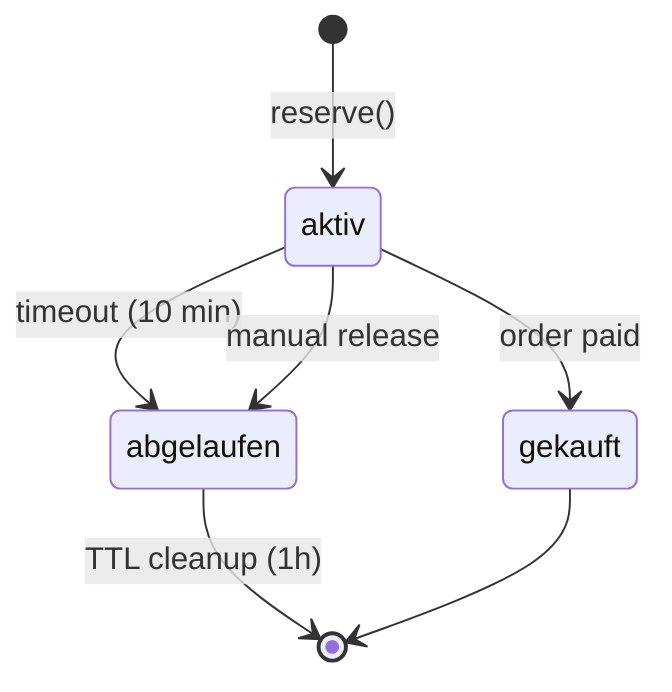

# Ticketing-System – Inventory & Concurrency

**Projekt:** EventApp  
**Stand:** Januar 2025

---

## 1. Problem: Overselling

**Szenario:** 100 User kaufen gleichzeitig das letzte verfügbare Ticket

**Ohne Atomarität:**
```typescript
// Thread A liest: verfügbar = 1
// Thread B liest: verfügbar = 1
// Thread A schreibt: verkauft + 1
// Thread B schreibt: verkauft + 1
// Result: 2 Tickets verkauft, obwohl nur 1 verfügbar
```

---

## 2. Lösung: MongoDB Transactions

**Datei:** `src/services/TicketReservationService.ts:12-117`

### 2.1 Reserve-Logik (Atomic)

```typescript
async reserveTickets(
  ticketVarianteId: string,
  menge: number,
  reserviert_fuer: string,
  timeoutMinutes: number = 10
): Promise<ReserveResult> {
  const session = await mongoose.startSession();
  session.startTransaction();

  try {
    // 1. Lock Variante (Read with Session)
    const variante = await TicketVariant.findById(ticketVarianteId).session(session);
    if (!variante) {
      await session.abortTransaction();
      return { success: false, error: 'Ticket-Variante nicht gefunden' };
    }

    // 2. Clean expired reservations
    await this.cleanupExpiredReservations(ticketVarianteId, session);

    // 3. Calculate available (considering active reservations)
    const activeReservations = await TicketReservation.aggregate([
      {
        $match: {
          ticketVarianteId: new mongoose.Types.ObjectId(ticketVarianteId),
          status: 'aktiv',
          expires_at: { $gte: new Date() },
        },
      },
      {
        $group: {
          _id: null,
          total_reserved: { $sum: '$menge' },
        },
      },
    ]).session(session);

    const totalReserved = activeReservations[0]?.total_reserved || 0;
    const available = variante.kontingentGesamt - variante.kontingentVerkauft - totalReserved;

    // 4. Check availability
    if (available < menge) {
      await session.abortTransaction();
      return {
        success: false,
        error: 'Not enough tickets available',
        available: Math.max(0, available),
      };
    }

    // 5. Create reservation
    const expires_at = new Date(Date.now() + timeoutMinutes * 60 * 1000);
    const reservation = await TicketReservation.create(
      [{
        ticketVarianteId: new mongoose.Types.ObjectId(ticketVarianteId),
        reserviert_fuer,
        menge,
        expires_at,
        status: 'aktiv',
      }],
      { session }
    );

    await session.commitTransaction();

    return {
      success: true,
      reservation: {
        id: reservation[0]._id,
        menge,
        expires_at,
      },
    };
  } catch (error: any) {
    await session.abortTransaction();
    logger.error('[TicketReservation] Reserve failed:', error);
    return { success: false, error: 'Reservierung fehlgeschlagen' };
  } finally {
    session.endSession();
  }
}
```

---

## 3. Key Mechanisms

### 3.1 MongoDB Sessions

```typescript
const session = await mongoose.startSession();
session.startTransaction();
// All operations with .session(session)
await session.commitTransaction();
```

**Garantien:**
- **Isolation:** Andere Sessions sehen uncommitted Changes nicht
- **Atomarität:** Entweder alle Ops erfolgreich oder alle rollback

---

### 3.2 Aggregation for Available Calc

```typescript
const totalReserved = await TicketReservation.aggregate([
  { $match: { ticketVarianteId, status: 'aktiv', expires_at: { $gte: now } } },
  { $group: { _id: null, total_reserved: { $sum: '$menge' } } }
]).session(session);
```

**Warum Aggregation?**
- Effizient für SUM-Berechnung
- Session-aware (Liest innerhalb Transaction)

---

### 3.3 Expired Cleanup

```typescript
private async cleanupExpiredReservations(
  ticketVarianteId: string,
  session: mongoose.ClientSession
) {
  await TicketReservation.updateMany(
    {
      ticketVarianteId: new mongoose.Types.ObjectId(ticketVarianteId),
      status: 'aktiv',
      expires_at: { $lt: new Date() },
    },
    { status: 'abgelaufen', updated_at: new Date() },
    { session }
  );
}
```

**TTL Index:** MongoDB löscht automatisch nach 1h (`expireAfterSeconds: 3600`)

---

## 4. Verfügbarkeit Formel

```
verfügbar = kontingentGesamt - kontingentVerkauft - aktivReservierungen
```

**Beispiel:**
- `kontingentGesamt`: 100
- `kontingentVerkauft`: 80 (bereits bezahlt)
- `aktivReservierungen`: 15 (andere User im Checkout)
- `verfügbar`: 100 - 80 - 15 = **5**

---

## 5. Reservation Lifecycle



**Timeouts:**
- **User Checkout:** 10 Minuten (konfigurierbar)
- **TTL Cleanup:** 1 Stunde nach `expires_at`

---

## 6. Order Creation & Inventory Update

**Datei:** `src/controllers/orderController.ts:66-95`

```typescript
for (const ticket of tickets) {
  const variant = await TicketVariant.findById(ticketVarianteId);
  
  // Check availability
  const verkauft = variant.kontingentVerkauft || 0;
  const kontingent = variant.kontingentGesamt || 0;
  
  if (verkauft + menge > kontingent) {
    return res.status(400).json({
      error: { 
        code: 'TICKET_SOLD_OUT', 
        message: `Only ${kontingent - verkauft} tickets available for ${variant.name}` 
      }
    });
  }
}
```

**Anmerkung:** Dieser Check ist **ohne Transaction** → Race Condition möglich!

**Lösung (Empfehlung):**
1. User ruft `/reserve-tickets` → Reservation erstellt (atomic)
2. User ruft `/orders/create` mit `reservationId`
3. Order-Creation überträgt Reservation in `kontingentVerkauft`

**Aktuell:** Kein Reservierungs-Endpoint exponiert → Direct Order Creation

---

## 7. Ticket-Generation & Inventory

**Datei:** `src/services/TicketGenerationService.ts:64-68`

```typescript
// Update verkauft counter on variant
variant.kontingentVerkauft = (variant.kontingentVerkauft || 0) + position.menge;
await variant.save();
```

**Wann:** Nach successful Payment (Webhook oder Capture)

**Race Condition?** Ja, aber praktisch unwahrscheinlich:
- Webhook und Frontend-Capture können gleichzeitig eintreffen
- **Idempotenz via Order._id:** `generateTicketsForOrder` wird nur 1x ausgeführt
- Tickets haben Unique `qrToken` → Duplikate unmöglich

---

## 8. Rollback Strategies

### 8.1 Payment Failed → Release Reservation

**Aktuell:** Nicht implementiert

**Empfehlung:**
```typescript
// Nach PayPal Capture Fail
if (!result.success) {
  await TicketReservationService.releaseReservation(reservationId);
}
```

---

### 8.2 Refund → Decrement Verkauft

**Datei:** `src/services/TicketGenerationService.ts:154-166`

```typescript
async invalidateTicketsForOrder(bestellungId: string): Promise<void> {
  await Ticket.updateMany(
    { bestellungId: new mongoose.Types.ObjectId(bestellungId) },
    { status: 'erstattet' }
  );
}
```

**Fehlt:** Decrement von `kontingentVerkauft`

**Empfehlung:**
```typescript
const tickets = await Ticket.find({ bestellungId });
for (const ticket of tickets) {
  const variant = await TicketVariant.findById(ticket.ticketVarianteId);
  variant.kontingentVerkauft = Math.max(0, variant.kontingentVerkauft - 1);
  await variant.save();
}
```

---

## 9. Query-Beispiele

### 9.1 Verfügbare Tickets prüfen

```typescript
const variant = await TicketVariant.findById(ticketVarianteId);

// Active reservations
const activeReservations = await TicketReservation.aggregate([
  { $match: { ticketVarianteId, status: 'aktiv', expires_at: { $gte: new Date() } } },
  { $group: { _id: null, total_reserved: { $sum: '$menge' } } }
]);

const totalReserved = activeReservations[0]?.total_reserved || 0;
const available = variant.kontingentGesamt - variant.kontingentVerkauft - totalReserved;
```

---

### 9.2 Expired Reservations bereinigen

```typescript
await TicketReservation.updateMany(
  { status: 'aktiv', expires_at: { $lt: new Date() } },
  { status: 'abgelaufen' }
);
```

**Hinweis:** TTL-Index macht das automatisch nach 1h

---

### 9.3 Sold-Out Status auto-setzen

```typescript
// TicketVariant Pre-Save Hook
TicketVariantSchema.pre('save', function(next) {
  if (this.kontingentVerkauft >= this.kontingentGesamt && this.status === 'live') {
    this.status = 'sold_out';
  }
  next();
});
```

**Datei:** `src/models/TicketVariant.ts:88-93`

---

## 10. Performance Considerations

### 10.1 Indexes

```typescript
// TicketReservation
{ ticketVarianteId: 1, status: 1 }
{ expires_at: 1, status: 1 }
{ expires_at: 1 } // TTL

// TicketVariant
{ eventId: 1, sichtbar: 1, sort: 1 }
```

**Warum wichtig?**
- Aggregation für `totalReserved` nutzt Index
- TTL Cleanup nutzt `expires_at` Index

---

### 10.2 Session-Overhead

**MongoDB Transactions:**
- Erfordern Replica Set (nicht Standalone)
- Leichter Performance-Overhead vs. Standalone Ops

**Trade-off:** Consistency > Performance für kritische Inventory

---

## 11. Edge Cases

### 11.1 Expired Reservation während Checkout

**Szenario:**
1. User reserviert Ticket (expires in 10 min)
2. User füllt Formular aus (dauert 12 min)
3. User klickt "Pay"

**Result:** Reservation ist `abgelaufen`, Kontingent wieder frei

**Handling:**
```typescript
// Bei Order Creation
const reservation = await TicketReservation.findById(reservationId);
if (reservation.status !== 'aktiv' || reservation.expires_at < new Date()) {
  return res.status(400).json({ error: 'Reservation expired, please retry' });
}
```

---

### 11.2 Concurrent Checkouts für letztes Ticket

**Szenario:** 2 User in `reserveTickets()` gleichzeitig

**Timeline:**
```
T0: available = 1
T1: User A startet Transaction A
T2: User B startet Transaction B
T3: Transaction A liest: available = 1
T4: Transaction B liest: available = 1 (sieht A's reservation noch nicht, da uncommitted)
T5: Transaction A committed: reservation created
T6: Transaction B committed: FAIL (Aggregation zeigt jetzt totalReserved=1, available=0)
```

**Result:** Nur User A bekommt Reservation, User B Error

---

### 11.3 Payment Capture nach Reservation Expired

**Szenario:**
1. User reserviert (10 min timeout)
2. User approved PayPal (nach 12 min)
3. Frontend ruft `/capture-order`

**Problem:** Reservation `abgelaufen`, Kontingent schon wieder freigegeben

**Aktuell:** Order-Creation prüft `kontingentVerkauft` ohne Reservation-Lookup → kann overselling verursachen

**Fix (Empfehlung):**
- Reservations verlängern wenn PayPal Order erstellt
- Oder: Reservations direkt in Order overführen (Status='pending')

---

## 12. Monitoring & Alerts

### 12.1 Kritische Metriken

```typescript
// Anzahl aktiver Reservierungen
db.ticket_reservierungen.countDocuments({ status: 'aktiv' })

// Durchschnittliche Reservation-Dauer
db.ticket_reservierungen.aggregate([
  { $match: { status: 'gekauft' } },
  { $project: { duration: { $subtract: ['$updated_at', '$created_at'] } } },
  { $group: { _id: null, avgDuration: { $avg: '$duration' } } }
])

// Overselling Detection
db.ticketvarianten.find({ kontingentVerkauft: { $gt: '$kontingentGesamt' } })
```

---

### 12.2 Alert-Regeln

- **Overselling:** `verkauft > gesamt` → Critical Alert
- **High Reservation Rate:** `aktive Reservierungen > 80% Kontingent` → Warning
- **Transaction Failures:** MongoDB Transaction Errors → Error Alert

---

## 13. Vergleich: Alternatives

### 13.1 Pessimistic Locking (Alternative)

```typescript
// Lock Row
const variant = await TicketVariant.findByIdAndUpdate(
  ticketVarianteId,
  { $inc: { __lock: 1 } }, // Increment lock counter
  { new: true }
);

// Check availability
if (variant.kontingentVerkauft + menge > variant.kontingentGesamt) {
  // Release lock
  await TicketVariant.findByIdAndUpdate(ticketVarianteId, { $inc: { __lock: -1 } });
  return error;
}

// Update verkauft
await TicketVariant.findByIdAndUpdate(
  ticketVarianteId,
  { $inc: { kontingentVerkauft: menge, __lock: -1 } }
);
```

**Nachteil:** Deadlock-Risiko bei komplexen Ops

---

### 13.2 Redis-basierte Locks (Alternative)

```typescript
const redisLock = await redisClient.set(`lock:ticket:${id}`, '1', 'EX', 10, 'NX');
if (!redisLock) return 'Locked by other user';

// Perform ops
await reserveTickets(...);

await redisClient.del(`lock:ticket:${id}`);
```

**Vorteil:** Distributed Locks  
**Nachteil:** Zusätzliche Infrastruktur

---

**Ende Inventory & Concurrency**  
Nächstes Dokument: `EMAIL_AND_QR_SPEC.md`
