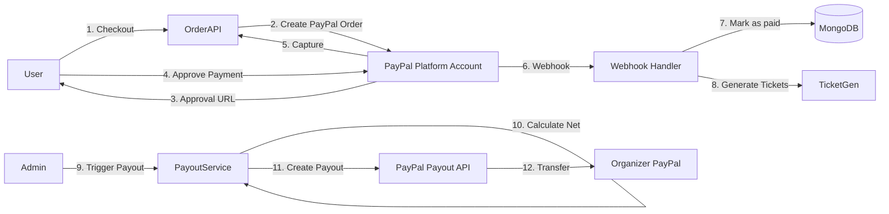
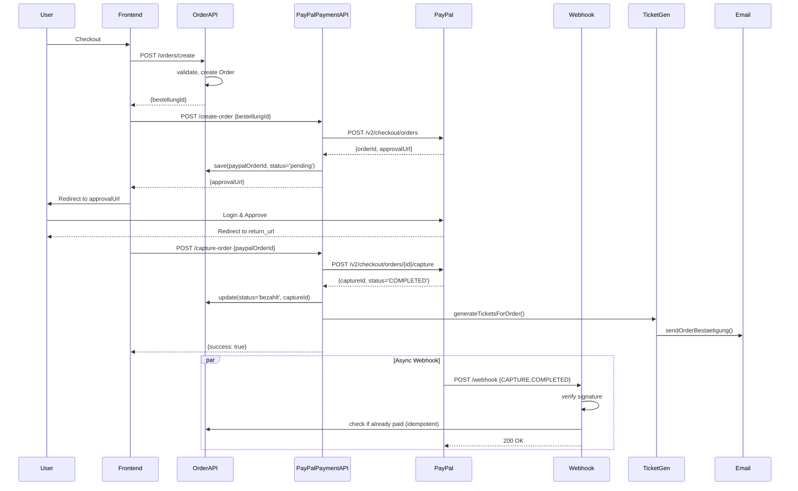

# Ticketing-System – PayPal Payment Flow

**Projekt:** EventApp  
**Stand:** Januar 2025

---

## 1. Übersicht

**Payment Model:** Platform-Modell (Marketplace)  
**Provider:** PayPal REST API v2  
**Platform Credentials:** `PAYPAL_CLIENT_ID`, `PAYPAL_CLIENT_SECRET` aus `.env`  
**Organizer Payout:** PayPal Email (manuell hinterlegt)

### 1.1 Money Flow

```
User zahlt 100 EUR
  → Platform Account (+100 EUR)
  → Platform behält 5% Fee (5 EUR)
  → Organizer erhält Payout (95 EUR)
```

**Kein Direct Payment:** Organizer empfängt Geld NICHT direkt vom User, sondern via Payout-API von Platform.

---

## 2. Architektur



---

## 3. Detailed Flow

### 3.1 Phase 1: Order Creation (Backend)

**Datei:** `src/controllers/orderController.ts:17-142`

```typescript
// 1. User sendet POST /orders/create
const { email, eventId, tickets, ... } = req.body;

// 2. Validierung
if (!agbAkzeptiert || !dsgvoAkzeptiert || !widerrufsbelehrungGelesen) {
  return 400;
}

// 3. Ticket-Varianten prüfen
for (ticket of tickets) {
  const variant = await TicketVariant.findById(ticket.ticketVarianteId);
  // Check availability
  if (verkauft + menge > kontingent) return 400;
}

// 4. Summe berechnen
summeBrutto = tickets.reduce((sum, t) => sum + (t.menge * t.einzelpreisBrutto), 0);
plattformFee = Math.round(summeBrutto * 0.05 * 100) / 100; // 5%

// 5. Order erstellen
const bestellung = await Order.create({
  buyerUserId: userId,
  email,
  eventId,
  positionen,
  summeBrutto,
  plattformFee,
  waehrung: 'EUR',
  status: 'offen'
});

// Response: { order: { _id, email, summeBrutto, status } }
```

---

### 3.2 Phase 2: PayPal Order Creation

**Datei:** `src/controllers/paypalPaymentController.ts:17-56`  
**Service:** `src/services/PayPalPaymentService.ts:86-171`

```typescript
// 1. Frontend sendet POST /payments/paypal/create-order
const { bestellungId } = req.body;

// 2. Order laden
const bestellung = await Order.findById(bestellungId).populate('eventId');

// 3. PayPal Access Token holen (Platform Credentials)
const accessToken = await getAccessToken(); // Basic Auth mit CLIENT_ID + SECRET

// 4. PayPal Order erstellen
const orderData = {
  intent: 'CAPTURE',
  purchase_units: [{
    reference_id: bestellung._id.toString(),
    description: `Tickets for ${event.title}`,
    amount: {
      currency_code: 'EUR',
      value: bestellung.summeBrutto.toFixed(2)
    }
  }],
  application_context: {
    brand_name: 'EventApp',
    return_url: `${FRONTEND_URL}/payment/success?orderId=${bestellung._id}`,
    cancel_url: `${FRONTEND_URL}/payment/cancel?orderId=${bestellung._id}`,
    user_action: 'PAY_NOW'
  }
};

const response = await axios.post(
  'https://api-m.sandbox.paypal.com/v2/checkout/orders',
  orderData,
  { headers: { Authorization: `Bearer ${accessToken}` } }
);

// 5. PayPal Order ID speichern
bestellung.paypalOrderId = response.data.id;
bestellung.status = 'pending';
await bestellung.save();

// 6. Approval URL zurückgeben
const approvalLink = response.data.links.find(link => link.rel === 'approve');
// Response: { approvalUrl, paypalOrderId }
```

**PayPal API Endpoint:** `POST /v2/checkout/orders`

---

### 3.3 Phase 3: User Payment Approval

**Ablauf:**
1. Frontend leitet User zu `approvalUrl` (PayPal-Webseite)
2. User loggt sich in PayPal ein
3. User bestätigt Zahlung
4. PayPal leitet zurück zu `return_url` mit `?token=<paypalOrderId>`

**Wichtig:** Payment ist NOCH NICHT captured, nur "approved"

---

### 3.4 Phase 4: Payment Capture (Frontend-initiiert)

**Datei:** `src/controllers/paypalPaymentController.ts:62-107`  
**Service:** `src/services/PayPalPaymentService.ts:176-239`

```typescript
// 1. Frontend sendet POST /payments/paypal/capture-order
const { paypalOrderId } = req.body;

// 2. Order laden
const bestellung = await Order.findOne({ paypalOrderId });

// 3. PayPal Access Token holen
const accessToken = await getAccessToken();

// 4. Capture durchführen
const response = await axios.post(
  `https://api-m.sandbox.paypal.com/v2/checkout/orders/${paypalOrderId}/capture`,
  {},
  { headers: { Authorization: `Bearer ${accessToken}` } }
);

const capture = response.data.purchase_units[0].payments.captures[0];

// 5. Status prüfen
if (capture.status === 'COMPLETED') {
  bestellung.status = 'bezahlt';
  bestellung.paypalCaptureId = capture.id; // UNIQUE!
  bestellung.bezahlt_at = new Date();
  await bestellung.save();
  
  // 6. Tickets generieren
  await TicketGenerationService.generateTicketsForOrder(bestellung._id);
  
  return { success: true, captureId: capture.id };
}
```

**PayPal API Endpoint:** `POST /v2/checkout/orders/{id}/capture`

---

### 3.5 Phase 5: Webhook (Async)

**Datei:** `src/controllers/paypalPaymentController.ts:157-196`, `handlePaymentCaptured:201-245`

```typescript
// 1. PayPal sendet POST /payments/paypal/webhook
const event = req.body;

// 2. Signature-Verifizierung (MVP: basic header check)
const isValid = await verifyPayPalWebhookSignature(req);
if (!isValid) return 401;

// 3. Event-Type prüfen
switch (event.event_type) {
  case 'PAYMENT.CAPTURE.COMPLETED':
    await handlePaymentCaptured(event);
    break;
  case 'PAYMENT.CAPTURE.REFUNDED':
    await handlePaymentRefunded(event);
    break;
}

// 4. handlePaymentCaptured()
async function handlePaymentCaptured(event) {
  const captureId = event.resource.id;
  const paypalOrderId = event.resource.supplementary_data.related_ids.order_id;
  
  const bestellung = await Order.findOne({ paypalOrderId });
  
  // Idempotenz: schon bezahlt?
  if (bestellung.status === 'bezahlt') return;
  
  bestellung.status = 'bezahlt';
  bestellung.paypalCaptureId = captureId; // UNIQUE Index verhindert Duplikate
  bestellung.bezahlt_at = new Date();
  await bestellung.save();
  
  // Tickets generieren
  await TicketGenerationService.generateTicketsForOrder(bestellung._id);
}
```

**Webhook Event Types:**
- `PAYMENT.CAPTURE.COMPLETED`
- `PAYMENT.CAPTURE.REFUNDED`
- `PAYMENT.CAPTURE.DENIED`

---

## 4. Sicherheit

### 4.1 Webhook Signature Verification

**Header:**
```http
paypal-transmission-id: 12345-67890
paypal-transmission-time: 2025-01-15T10:30:00Z
paypal-cert-url: https://api.paypal.com/v1/notifications/certs/...
paypal-auth-algo: SHA256withRSA
paypal-transmission-sig: xYz123...
```

**Implementierung (MVP):**  
`src/controllers/paypalPaymentController.ts:112-151`

```typescript
async function verifyPayPalWebhookSignature(req: Request): Promise<boolean> {
  const transmissionId = req.headers['paypal-transmission-id'];
  const transmissionSig = req.headers['paypal-transmission-sig'];
  
  // MVP: Basic validation
  if (!transmissionId || !transmissionSig) {
    return false;
  }
  
  // In production: Download cert from cert_url, verify signature
  // For now: Accept
  return true;
}
```

**Production TODO:**
1. Download PayPal Cert von `cert_url`
2. Verify Signature mit Public Key
3. Verify `webhook_id` gegen `PAYPAL_WEBHOOK_ID`
4. Siehe: https://developer.paypal.com/api/rest/webhooks/#verify-signature

---

### 4.2 Idempotenz

**Problem:** Webhook kann mehrfach eintreffen (Retry bei 5xx)

**Lösung:** `paypalCaptureId` Unique Index

```typescript
// MongoDB Schema
paypalCaptureId: { type: String, unique: true, sparse: true }

// Bei Webhook
bestellung.paypalCaptureId = captureId; // Wirft Duplicate Key Error bei 2. Versuch
```

**Zusätzlich:** Status-Check `if (bestellung.status === 'bezahlt') return;`

---

### 4.3 CSRF/Nonce

**Keine CSRF-Tokens nötig** – Webhook ist server-to-server, keine Browser-Session.

**Aber:** Signature-Verifizierung ist kritisch!

---

## 5. Organizer Payout

**Datei:** `src/services/PayPalPayoutService.ts`

### 5.1 Payout Trigger (Admin-initiiert)

```typescript
// Admin ruft auf
await PayoutService.processOrganizerPayout(organizerId, {
  clientId: PAYPAL_CLIENT_ID,
  clientSecret: PAYPAL_CLIENT_SECRET,
  environment: 'sandbox'
});
```

### 5.2 Payout-Flow

```typescript
// 1. Pending Balance berechnen
const balance = await getPendingBalance(organizerId);
// totalGross: 1000 EUR (alle bezahlten Orders)
// platformFee: 50 EUR (5%)
// totalNet: 950 EUR (auszuzahlen)

// 2. Organizer PayPal Email holen
const organizer = await Organizer.findById(organizerId);
const paypalEmail = organizer.paypalOAuth?.merchantEmail 
  || organizer.abrechnungsEinstellungen?.paypalEmail;

// 3. PayPal Access Token holen
const accessToken = await getAccessToken(config);

// 4. Payout erstellen
const payoutData = {
  sender_batch_header: {
    sender_batch_id: `payout_${Date.now()}_${organizerId}`,
    email_subject: 'You have a payout from EventApp'
  },
  items: [{
    recipient_type: 'EMAIL',
    amount: { value: '950.00', currency: 'EUR' },
    receiver: paypalEmail,
    note: 'EventApp payout'
  }]
};

const response = await axios.post(
  'https://api-m.sandbox.paypal.com/v1/payments/payouts',
  payoutData,
  { headers: { Authorization: `Bearer ${accessToken}` } }
);

// 5. Orders als 'paid out' markieren
await Order.updateMany(
  { eventId: { $in: eventIds }, payoutStatus: { $ne: 'paid' } },
  { 
    payoutStatus: 'paid',
    payoutDate: new Date(),
    payoutBatchId: response.data.batch_header.payout_batch_id,
    payoutAmount: 950,
    platformFee: 50
  }
);
```

**PayPal API Endpoint:** `POST /v1/payments/payouts`

---

## 6. Environment Variables

**Datei:** `.env.example:18-22`

```bash
# PayPal
PAYPAL_CLIENT_ID=your-client-id
PAYPAL_CLIENT_SECRET=your-secret
PAYPAL_MODE=sandbox  # oder 'live'
PAYPAL_WEBHOOK_ID=your-webhook-id
```

**API Base URLs:**
- Sandbox: `https://api-m.sandbox.paypal.com`
- Production: `https://api-m.paypal.com`

---

## 7. Fehlerfälle & Rollback

### 7.1 Capture Failed

**Szenario:** PayPal lehnt Capture ab (insufficient funds, etc.)

```typescript
if (capture.status !== 'COMPLETED') {
  logger.warn('[PayPal Payment] Capture not completed:', { captureStatus });
  return { success: false, captureId };
}
```

**Order bleibt in `pending`**, User muss Payment erneut versuchen.

---

### 7.2 Webhook Verlust

**Szenario:** Webhook kommt nicht an (Network Error)

**Fallback:** Frontend-Capture führt Ticket-Generation durch:

```typescript
// paypalPaymentController.ts:81-89
if (bestellung && bestellung._id) {
  await TicketGenerationService.generateTicketsForOrder(bestellung._id.toString());
}
```

**Result:** Tickets werden entweder via Webhook ODER via Frontend-Capture generiert (Idempotenz via Order._id check).

---

### 7.3 Email Failed

**Szenario:** Resend API down

```typescript
// TicketGenerationService.ts:95-98
catch (emailError) {
  logger.error('[Ticket Generation] Email failed:', emailError);
  // Don't throw - tickets are created, email is secondary
}
```

**Tickets existieren**, Email sollte via Retry-Queue nachgesendet werden (aktuell nicht implementiert).

---

## 8. Sequenzdiagramm (Vollständig)



---

## 9. Test-Flow (Sandbox)

### 9.1 Test Credentials

**Sandbox Buyer Account:**
- Email: `sb-buyer@personal.example.com`
- Password: `12345678`

**Sandbox Business Account (Platform):**
- Client ID: `AXm...` (aus .env)
- Secret: `EO1...` (aus .env)

### 9.2 Test-Ablauf

1. Starte Backend: `npm run dev`
2. POST `/orders/create` → bestellungId
3. POST `/payments/paypal/create-order` → approvalUrl
4. Öffne approvalUrl im Browser
5. Login mit sb-buyer Account
6. Approve Payment
7. PayPal redirect zu return_url
8. POST `/payments/paypal/capture-order` → success
9. Prüfe Email (Logs, wenn Resend nicht konfiguriert)
10. Prüfe MongoDB: Order.status = 'bezahlt', Tickets erstellt

---

## 10. Dateien-Referenz

| Datei | Zweck |
|-------|-------|
| `src/services/PayPalPaymentService.ts` | PayPal Order/Capture Logic |
| `src/services/PayPalPayoutService.ts` | Organizer Payout Logic |
| `src/controllers/paypalPaymentController.ts` | REST Endpoints |
| `src/routes/v1/paypalPayment.ts` | Route Definitions |
| `src/models/Order.ts` | Order Model mit PayPal-Feldern |
| `tests/integration/paypal-end-to-end.test.ts` | E2E Test |

---

**Ende PayPal Flow**  
Nächstes Dokument: `INVENTORY_AND_CONCURRENCY.md`
