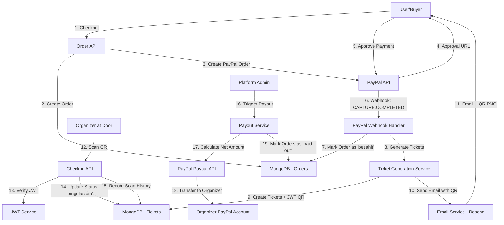
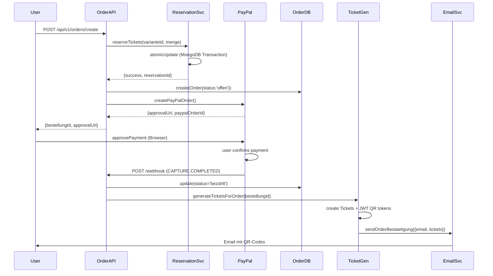
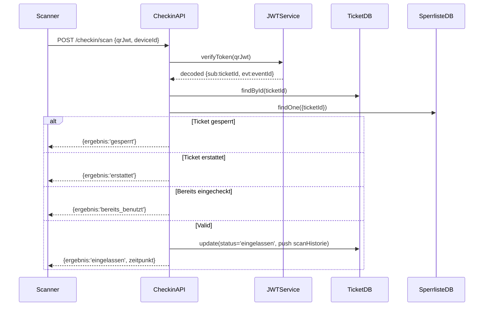
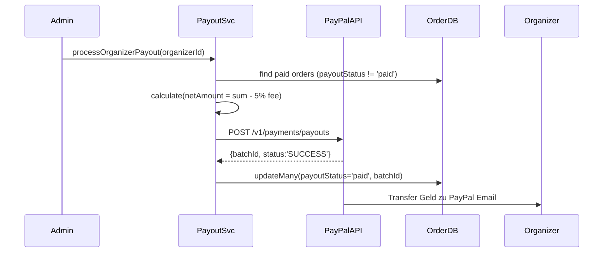

# Ticketing-System – High-Level Übersicht

**Projekt:** EventApp (Verdrehte Welt Kontext)  
**Version:** 1.0  
**Stand:** Januar 2025  
**Autoren:** Read-Only Analyse

---

## 1. Architektur-Übersicht

Das Ticketing-System ist als **Platform-Modell** (Marketplace) aufgebaut:
- Die **Plattform** verarbeitet alle Zahlungen
- **Organizer** erhalten Auszahlungen abzüglich Platform-Fee (5%)
- Tickets werden als **JWT-signierte QR-Codes** generiert
- Check-in erfolgt per **Scan** (Online/Offline-fähig)



---

## 2. Bounded Contexts

### 2.1 **Ticketing Context**
- **Verantwortung:** Ticket-Varianten definieren, Verkaufsfenster, Kontingente
- **Entitäten:** `TicketVariant`, `TicketReservation`
- **Services:** `TicketReservationService`
- **Dateien:**
  - `src/models/TicketVariant.ts`
  - `src/models/TicketReservation.ts`
  - `src/services/TicketReservationService.ts`

### 2.2 **Orders Context**
- **Verantwortung:** Bestellungen erstellen, Statusverwaltung, Lifecycle
- **Entitäten:** `Order`
- **Services:** `OrderController`
- **Statusübergänge:** `offen → pending → bezahlt → (erstattet|abgebrochen)`
- **Dateien:**
  - `src/models/Order.ts`
  - `src/controllers/orderController.ts`
  - `src/routes/v1/orders.ts`

### 2.3 **Payments Context**
- **Verantwortung:** PayPal-Integration, Capture, Webhooks, Idempotenz
- **Entitäten:** Keine eigenen (verknüpft mit `Order`)
- **Services:** `PayPalPaymentService`, `PayPalPayoutService`
- **Dateien:**
  - `src/services/PayPalPaymentService.ts`
  - `src/services/PayPalPayoutService.ts`
  - `src/controllers/paypalPaymentController.ts`
  - `src/routes/v1/paypalPayment.ts`

### 2.4 **Inventory Context**
- **Verantwortung:** Kontingent-Verwaltung, Race-Condition-Prävention, Reservierungen
- **Mechanismus:** MongoDB-Transaktionen für atomare Updates
- **Dateien:**
  - `src/services/TicketReservationService.ts`
  - `src/models/TicketVariant.ts` (Felder: `kontingentGesamt`, `kontingentVerkauft`)

### 2.5 **QR/Validation Context**
- **Verantwortung:** JWT-Token generieren/verifizieren, QR-Codes erstellen
- **Algorithmus:** HS256 (Fallback) oder RS256 (wenn Keys konfiguriert)
- **Expiry:** 365 Tage Standard
- **Services:** `TicketQRService`, `TicketGenerationService`
- **Dateien:**
  - `src/services/TicketQRService.ts`
  - `src/services/TicketGenerationService.ts`

### 2.6 **Check-in Context**
- **Verantwortung:** Ticket-Scans, Status-Updates, Blacklist-Verwaltung
- **Entitäten:** `Ticket`, `CheckinSperrliste`
- **Scan-Modi:** `tuer`, `abendkasse`, `manuell`
- **Dateien:**
  - `src/models/Ticket.ts`
  - `src/models/CheckinSperrliste.ts`
  - `src/controllers/checkinController.ts`
  - `src/routes/v1/checkin.ts`

### 2.7 **Notifications Context**
- **Verantwortung:** Email-Versand (Bestätigung, Reminder, Rückerstattung)
- **Provider:** Resend (via API)
- **Templates:** Inline HTML in `TicketEmailService`
- **QR-Einbettung:** Cloudinary Public URLs (Gmail-kompatibel)
- **Dateien:**
  - `src/services/TicketEmailService.ts`
  - `src/services/CloudinaryQRService.ts`

---

## 3. Datenflüsse

### 3.1 Checkout-Flow (Happy Path)



### 3.2 Check-in-Flow



### 3.3 Payout-Flow



---

## 4. Nebenläufigkeit & Race Conditions

### 4.1 Problem: Overselling
- **Szenario:** Zwei User kaufen zeitgleich das letzte Ticket
- **Lösung:** MongoDB Transactions + Aggregation für atomare Verfügbarkeitsprüfung

```typescript
// src/services/TicketReservationService.ts:18-94
const session = await mongoose.startSession();
session.startTransaction();
// 1. Get variante WITH lock (session)
// 2. Clean expired reservations
// 3. Aggregate active reservations
// 4. Check: available = gesamt - verkauft - reserviert
// 5. Create reservation OR abort
await session.commitTransaction();
```

### 4.2 Idempotenz
- **PayPal Webhook:** Idempotenz-Prüfung via `paypalCaptureId` (Unique Index)
- **Order Creation:** Optional `idempotenzKey` Feld (Unique Index)
- **Ticket Generation:** Nur bei Status `bezahlt` oder `confirmed` ausgeführt

### 4.3 Rollback-Strategie
- **Payment fehlgeschlagen:** Order bleibt in `pending`, keine Tickets generiert
- **Email fehlgeschlagen:** Tickets existieren, Email wird geloggt (sollte Retry-Queue haben)
- **Webhook-Verlust:** Manuelle Capture via `/capture-order` Endpoint möglich

---

## 5. Statusmaschinen

### 5.1 Order Status
```
offen → pending → bezahlt → completed
        ↓           ↓           ↓
    expired    abgebrochen  erstattet
```

- **offen:** Order erstellt, kein PayPal Order
- **pending:** PayPal Order erstellt, wartet auf User-Approval
- **bezahlt:** Payment captured, Tickets generiert
- **completed:** Event abgeschlossen (optional)
- **erstattet:** Refund durchgeführt
- **abgebrochen:** User oder System abgebrochen
- **expired:** PayPal Order expired (nicht captured innerhalb 3 Stunden)

### 5.2 Ticket Status
```
gueltig → eingelassen
   ↓          
erstattet
   ↓
gesperrt
```

- **neu:** Initial (legacy, nicht mehr verwendet)
- **gueltig:** Ticket valide, bereit für Check-in
- **eingelassen:** Check-in durchgeführt, `scanHistorie` enthält Eintrag
- **erstattet:** Order refunded, Ticket ungültig
- **gesperrt:** Manuell gesperrt (Blacklist)

### 5.3 TicketVariant Status
```
draft → live → sold_out
        ↓
      hidden
```

- **draft:** Noch nicht verkaufsbereit
- **live:** Öffentlich sichtbar, kaufbar
- **sold_out:** Kontingent erschöpft (auto-gesetzt bei `kontingentVerkauft >= kontingentGesamt`)
- **hidden:** Manuell ausgeblendet

### 5.4 Reservation Status
```
aktiv → gekauft
  ↓
abgelaufen (TTL Index: 3600s)
```

- **aktiv:** Reservierung gültig
- **abgelaufen:** Timeout erreicht oder manuell released
- **gekauft:** Order bezahlt, Reservierung in `kontingentVerkauft` überführt

---

## 6. Sicherheit

### 6.1 QR-Token Signatur
- **Algorithmus:** JWT HS256 (Fallback) oder RS256 (Produktion empfohlen)
- **Secret:** `JWT_SECRET` oder RSA-Keypair (`JWT_PRIVATE_KEY`, `JWT_PUBLIC_KEY`)
- **Payload:** `{sub: ticketId, evt: eventId, typ: ticketVarianteId, ver: 1, iat, exp}`
- **Expiry:** 365 Tage (konfigurierbar)

### 6.2 PayPal Webhook Verification
- **Header-Prüfung:** `paypal-transmission-id`, `paypal-transmission-sig`
- **Implementiert:** Basic Header-Prüfung (MVP)
- **Empfehlung:** Vollständige Signaturprüfung mit PayPal Cert-Download

### 6.3 Authorization
- **Buyer:** Optional Auth (Guests können kaufen)
- **Organizer:** `authGuard` für Check-in, Orders, Stats
- **Admin:** `authGuard` + Role-Check für Payouts

---

## 7. Limitierungen & Annahmen

### 7.1 Annahmen
- **Single Currency:** EUR (hardcoded in vielen Stellen)
- **PayPal only:** Kein Stripe-Code aktiv im Ticketing
- **Email Provider:** Resend (konfiguriert via `MAIL_API_KEY`)
- **Image Storage:** Cloudinary für QR-Codes

### 7.2 Bekannte Limitierungen
- **Keine Stripe-Integration:** Event-Model hat `paymentProvider` Feld, aber nur PayPal implementiert
- **Kein Retry-Queue:** Email-Fehler werden nur geloggt
- **Webhook Race:** Webhook + Frontend Capture können gleichzeitig auftreten (Idempotenz handled das)
- **Offline-Check-in:** JWT-Verify funktioniert offline, aber Status-Update erfordert Netzwerk

---

## 8. Performance & Skalierung

### 8.1 Indizes
- **Order:** `{email, eventId}`, `{paypalCaptureId}`, `{eventId, status, erstellt_at}`
- **Ticket:** `{eventId, status}`, `{qrToken}`, `{bestellungId}`
- **TicketReservation:** `{ticketVarianteId, status}`, TTL-Index auf `expires_at`

### 8.2 Bottlenecks
- **Email-Versand:** Synchron in Ticket-Generation (sollte Queue sein)
- **PayPal API Calls:** Keine Retry-Logik implementiert
- **Cloudinary Upload:** Pro QR-Code 1 Request (könnte gebatched werden)

---

## 9. Testing

### 9.1 Vorhandene Tests
- `tests/integration/paypal-end-to-end.test.ts`: Vollständiger Order → Payment → Payout Flow
- Weitere Integration-Tests unter `tests/integration/`

### 9.2 Coverage-Hinweise
- **QR-Generation:** Unit-Tests fehlen
- **Check-in Scan:** E2E-Tests fehlen
- **Webhook-Verarbeitung:** Nur Happy-Path getestet

---

## 10. Dateistruktur (Kurzreferenz)

```
src/
├── models/
│   ├── Order.ts                    # Bestellung
│   ├── Ticket.ts                   # Generiertes Ticket mit QR
│   ├── TicketVariant.ts            # Ticket-Typ (Preis, Kontingent)
│   ├── TicketReservation.ts        # Temporäre Reservierung
│   ├── CheckinSperrliste.ts        # Blacklist
│   └── Event.ts                    # Event-Kontext
├── services/
│   ├── TicketGenerationService.ts  # Ticket-Erzeugung + JWT
│   ├── TicketReservationService.ts # Atomare Reservierung
│   ├── TicketQRService.ts          # JWT Sign/Verify + QR PNG
│   ├── TicketEmailService.ts       # Email-Templates + Resend
│   ├── PayPalPaymentService.ts     # Payment Flow
│   ├── PayPalPayoutService.ts      # Organizer Auszahlungen
│   └── CloudinaryQRService.ts      # QR-Upload zu Cloudinary
├── controllers/
│   ├── orderController.ts          # POST /orders/create, GET /orders/:id
│   ├── ticketingController.ts      # Legacy Ticketing (?)
│   ├── paypalPaymentController.ts  # POST /payments/paypal/create-order, /capture-order, /webhook
│   └── checkinController.ts        # POST /checkin/scan, /block, /unblock
└── routes/v1/
    ├── orders.ts
    ├── paypalPayment.ts
    └── checkin.ts
```

---

## 11. Nächste Schritte für Produktivbetrieb

1. **Webhook-Signatur:** Vollständige PayPal Cert-Verifizierung implementieren
2. **Retry-Queue:** Email-Fehler in Queue (Redis/SQS) statt nur loggen
3. **Stripe:** Falls gewünscht, Stripe-Adapter nach PayPal-Vorbild
4. **Monitoring:** Sentry-Alerts für Payment-Fehler, Ticket-Generation-Fehler
5. **Rate-Limiting:** Check-in Endpoint absichern (max. 1 Scan/Sekunde/Device)
6. **Offline-Check-in:** Lokale DB-Sync für Organizer-Geräte

---

**Ende der Übersicht**  
Weiterführende Details in den Folgedokumenten: `DATA_MODELS.md`, `API_CONTRACT_TICKETING.md`, etc.
